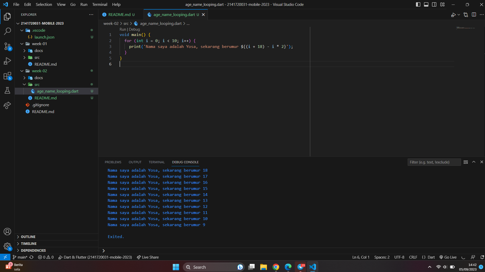

# Pemrograman Mobile - Pertemuan 2

NIM :  2141720031

NAMA : Josafat Pratama Susilo

## Tugas Praktikum

Jawaban Soal:

1. Tampilan Screenshot:

    

2. Mempelajari bahasa pemrograman Dart sebelum mempelajari framework Flutter sangatlah penting. Hal ini dikarenakan framework Flutter menggunakan bahasa pemrograman Dart sebagai basisnya, hal tersebut sama halnya dengan framework laravel yang menggunakan bahasa pemrograman PHP sebagai basisnya. Meskipun bahasa pemrograman Dart kurang lebih sama dengan bahasa lainnya dalam hal syntax (cara penulisan variabel, perulangan, control flow statement, dll), namun terdapat beberapa fitur dalam bahasa Dart yang cukup penting untuk diketahui sehingga dapat membantu dalam melakukan developing sebuah aplikasi Flutter itu sendiri. Fitur-fitur tersebut seperti Garbage Collecion, Null safety, Late Variables, Null-aware dan Null-assertion, dll.

3. - Terdapat berbagai fitur dalam bahasa pemrograman Dart, salah satunya adalah Garbage Collection. Garbage Collection adalah sebuah fitur yang digunakan untuk efisiensi alokasi memori dan dealokasi memori dalam bahasa pemrograman Dart.Dengan menggunakan fitur Garbage collection, maka dalam membuat sebuah kode program, akan saya usahakan untuk membuat variabel yang lebih efisien. Hal ini dilakukan dengan membuat variabel seminim mungkin supaya alokasi memori dapat menjadi efisien dan program akan berjalan lebih baik.
    - Dart memiliki fitur Portability sehingga ketika ingin membuat sebuah program yang berjalan pada beberapa jenis device yang berbeda, maka saya akan menggunakan Dart sebagai bahasa pemrograman.
    - Dart memiliki fitur Just-In-Time yang ada pada fitur Hot Reload pada saat mengembangkan aplikasi mobile. Hal ini akan sangat membantu sehingga waktu yang diperlukan untuk melakukan pengembangan akan sangat lebih efisien tanpa harus melakukan compile semua kode program dan hanya kode program yang diubah saja.
    - Dart yang dirancang untuk Object-Oriented. Hal ini akan sangat membantu saya dalam mengembangkan sebuah aplikasi. Keuntungan-keuntungan dalam OOP seperti reusability-nya akan sangat berguna sehingga tidak perlu menulis kode-kode secara berulang-ulang dan lebih efisien dalam pengerjaannya.

4. [Link Canva](https://www.canva.com/design/DAFtkOGyKiA/8gbd3E6LPuJI0Z7zLwKvqw/edit)