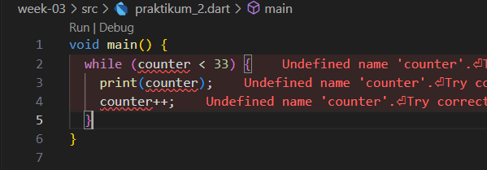

# Pemrograman Mobile - Pertemuan 3

NIM :  2141720031

NAMA : Josafat Pratama Susilo

## Praktikum 1
### - Langkah 1

### - Langkah 2
Ketika program coba dieksekusi, maka akan gagal karena terdapat error pada beberapa kode program. Error-error tersebut adalah sebagai berikut:

- Huruf i pada keyword If yang kapital, seharusnya adalah huruf non-kapital.
- Huruf e pada keyword Else yang kapital, seharusnya adalah huruf non-kapital.

### - Langkah 3
Ketika program coba dieksekusi, maka akan gagal. Hal ini dikarenakan variabel test yang sudah ada diatas. 

Untuk mengatasinya, maka variabel test yang ada diatas harus dihapus. Selain itu conditional menggunakan if hanya dapat menerima value boolean, sedangkan variabel test merupakan variabel bertipe string. Untuk mengatasinya, maka variabel test harus diubah menjadi boolean. Berikut adalah hasil perbaikan keseluruhan kode program baik untuk program langkah 1 dan langkah 3.

Output:

## Praktikum 2
### - Langkah 1

### - Langkah 2
Ketika program akan dijalankan maka akan terdapat error dan tidak dapat dijalankan. Hal ini dikarenakan variabel counter yang akan digunakan untuk iterasi tidak ada. Untuk memberbaiki error tersebut, maka perlu dibuat sebuah variabel bernama counter seperti berikut.

Output

### - Langkah 3
Ketika program dieksekusi, tidak terjadi error dan program dapat dieksekusi serta tampil output dari kode program tersebut. Hal ini dikarenakan, variabel counter yang telah dibuat pada langkah sebelumnya ada dan digunakan untuk iterasi pada kode untuk langkah 3 dengan melanjutkan iterasi setelah perulangan while pada langkah 1 dan 2. Berikut adalah hasil perbaikan keseluruhan kode program baik untuk program langkah 1, 2, dan 3.

Output

## Praktikum 3
### - Langkah 1

### - Langkah 2
Ketika program akan dieksekusi terdapat error sehingga program tidak dapat dijalankan. Hal ini dikarenakan variabel index yang digunakan untuk iterasi tidak ada atau tidak terdefinisi. Selain itu, huruf i pada Index untuk inisialisasi dan print index berupa huruf kapital yang seharusnya adalah huruf non-kapital. Kemudian, tidak terdapat increment yang seharusnya ada pada syntax for tersebut, jika tidak terdapat increment maka variabel index akan selalu 10 dan akan terjadi infinite loop karena kondisi perulangan akan selalu true (variabel index akan selalu 10 dan tidak menyentuh angka 27). Untuk mengatasinya, maka berikut adalah perbaikan kode program tersebut.

Sehingga menghasilkan output:

## - Langkah 3
Ketika program dicoba untuk dieksekusi, maka program akan gagal dieksekusi karena terdapat error pada baris kodenya. Error tersebut dikarenakan huruf i pada keyword If seharusnya adalah huruf non-kapital, selain itu huruf i pada variabel Index seharusnya juga adalah huruf non-kapital, kemudian huruf e pada keyword Else sehaursnya juga adalah huruf non-kapital. Jika diperbaiki, maka kode program akan menjadi seperti berikut.

Dengan output sebagai berikut:

## Tugas Praktikum - Program Menampilkan Bilangan Prima dari 0 - 201

Kode Program:

Output:

## Tugas Praktikum - Cara Kerja Switch Case dengan break

### - Perbandingan Case String dengan Variabel Integer
Kode Program:

Output:

Penjelasan: Hasil Output program diatas adalah 3, hal ini dikarenakan nilai yang dibandingkan adalah sebuah int bernilai 1 sedangkan case-nya bernilai String. Perbedaan nilai tersebut menyebabkan tidak ada case yang sama dengan nilai yang dibandingkan sehingga akan masuk ke dalam default yang akan melakukan print a + 2 yaitu 1 + 2 yang akan menghasilkan output 3.

### - Perbandingan Case Integer dengan Variabel Integer
Kode Program:

Output:

Penjelasan:
Output kode program diatas adalah 1 yang berada pada case 2. Hal ini dapat terjadi karena tidak terdapat keyword break pada case 1, sehingga program akan lanjut menuju case sebelumnya hingga terdapat break. Pada contoh ini terdapat pada case 2 yang memiliki keyword break di dalamnya, sehingga program akan berhenti dan akan melakukan print nilai a yaitu 1. Jika case 2 juga tidak memiliki keyword break, maka akan lanjut menuju case 3 dan seterusnya hingga terdapat keyword break.