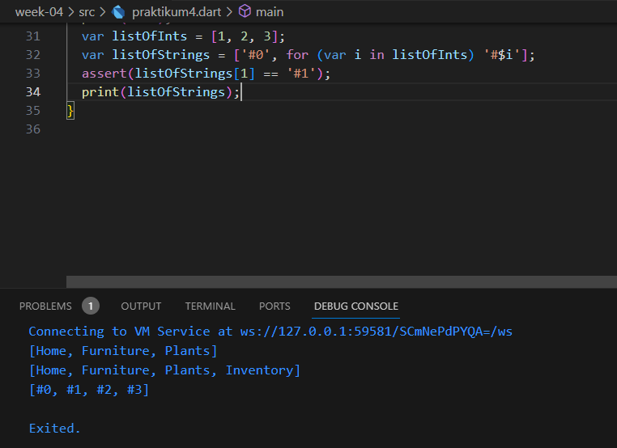

# Pemrograman Mobile - Pertemuan 3

NIM :  2141720031

NAMA : Josafat Pratama Susilo

## Daftar Isi

- [Praktikum 1](#praktikum-1)
- [Praktikum 2](#praktikum-2)
- [Praktikum 3](#praktikum-3)
- [Praktikum 4](#praktikum-4)
- [Praktikum 5](#praktikum-5)
- [Tugas Praktikum](#tugas-praktikum)

## Praktikum 1

### Langkah 1


### Langkah 2

Setelah program di eksekusi, maka akan tampil output seperti berikut:


Output program menjadi seperti itu dikarenakan, kode program baris ke 5, terdapat kode program yang melakukan print panjang list dengan syntax 
```dart
print(list.length)
```
yang akan menghasilkan output 3, karena terdapat 3 elemen di dalam list tersebut, yaitu 1, 2, dan 3.

Setelah itu, pada kode progam baris ke 6 terdapat kode program yang melakukan print elemen list ke-1 dengan syntax
```dart
print(list[1])
```

yang akan menghasilkan output 2, karena elemen ke-1 dari list tersebut adalah 2.

Kemudian, pada kode program baris ke 10 terdapat kode program yang melakukan print elemen list ke-1 juga dengan syntax
```dart
print(list[1])
```

Namun, pada kode program baris ke 8, elemen ke-1 dari list tersebut sudah diubah menjadi 1, sehingga outputnya menjadi 1 dan bukan 2.

### Langkah 3


Tidak terdapat error dalam kode program diatas, karena pada saat membuat default value null, pada tipe data String diberi question mark yang menyatakan null safety. Kemudian karena list memulai index dari 0, maka jika mengubah elemen pada index 1 dan 2, yang terubah adalah urutan ke-2 dan ke-3.

## Praktikum 2

### Langkah 1


### Langkah 2

Setelah di eksekusi maka program akan menghasilkan output seperti berikut:


Output program merupakan hasil dari kode program baris ke-3 yang melakukan print terhadap variabel set bernama halogens. Variabel set tersebut berisi elemen 'fluorine', 'chlorine', 'bromine', 'iodine', dan 'astatine'.

### Langkah 3


Tidak ada error di dalam kode program tersebut, karena hanya melakukan print terhadap set kosong.

Selanjutnya terdapat perintah tambahan untuk menambahkan nama dan NIM pada masing-masing set names1 dan names2 dengan fungsi ```.add()``` dan fungsi ```.addAll()```. Saya menambahkan kode program tersebut menjadi seperti berikut beserta output-nya:


## Praktikum 3

### Langkah 1


### Langkah 2


Output di atas merupakan hasil print dari map gifts dan nobleGases. Map gifts berisi elemen 'first', 'second', dan 'fifth' dengan value 'partridge', 'turtledoves', dan 1. Map nobleGases berisi elemen 2, 10, dan 18 dengan value 'helium', 'neon', dan 2.

### Langkah 3


Tidak terdapat error pada eksekusi kode program diatas karena hanya menambah inisialisasi map mhs1 dan mhs2 serta mencoba mengisi elemen map sesuai dengan key. Namun, tampak bahwa value dari key yang diubah tidak berubah dan tetap, seperti key 'fifth' pada map gifts yang tetap memiliki value 1 dan key 18 pada map nobleGases yang tetap memiliki value 2.

Selanjutnya saya menambahkan nama dan NIM pada Map gifts, nobleGases, mhs1, dan mhs2. Berikut kode programnya:


Dengan output sebagai berikut:


## Praktikum 4

### Langkah 1


### Langkah 2

Terdapat error pada kode program diatas, karena pada baris program ke 4 terdapat print variabel list1 yang belum didefinisikan. Setelah mengubah nama variabel list menjadi list1, maka kode program akan tampil seperti berikut:


### Langkah 3


Terdapat error pada kode program yang berada di baris kode ke 8, karena variabel list1 bukanlah variabel bertipe null-safety sehingga variabel list1 perlu untuk diubah ke null-safety dahulu seperti berikut:


Kemudian saya menambahkan sebuah variabel list baru berisi Nama dan NIM saya menggunakan spread operators, dengan kode program beserta output sebagai berikut:


### Langkah 4


Terdapat error karena variabel promoactive belum didefinisikan. Kemudian saya menambahkan kode program untuk mendefinisikan variabel promoactive, dengan kode program beserta output sebagai berikut:


Kemudian berikut outputnya jika variabel promoactive diubah menjadi false:


### Langkah 5


Terdapat error karena variabel login belum didefinisikan, kemudian saya menambahkan kode program untuk mendefinisikan variabel login, dengan kode program beserta output sebagai berikut:


Kemudian berikut kode program dan outputnya jika variabel login diubah menjadi 'User' dan kondisi diubah menjadi jika login juga merupakan user akan menghasilkan kondisi true:


### Langkah 6



Tidak terdapat error pada kode program diatas. Manfaat dari Collection For adalah untuk melakukan iterasi pada sebuah collection.

## Praktikum 5

### Langkah 1


### Langkah 2

Ketika dijalankan akan muncul output 

```bash
(first, last, a:2, b: true)

Exited.
```

Tidak terdapat error pada kode program diatas.

### Langkah 3


Ketika dijalankan tidak ada yang terjadi karena function tukar belum dijalankan/dipanggil dalam fungsi main. Kemudian saya menambahkan kode program untuk memanggil function tukar, dengan kode program beserta output sebagai berikut:


### Langkah 4


Terdapat error yang menyatakan mahasiswa memiliki value null dan variabel tersebut bukanlah null-safety (non-nullable) maka terjadi error. Oleh karena itu, saya menambahkan kode program untuk mengubah variabel mahasiswa menjadi null-safety, dengan kode program beserta output sebagai berikut:


Selanjutnya saya menambahkan kode program untuk menginisialisasi Nama dan NIM saya pada variabel mahasiswa sebagai berikut beserta dengan outputnya:


### Langkah 5


Tidak terdapat error pada kode program diatas. Kemudian saya mengganti salah satu isi record dengan Nama dan NIM saya. Berikut hasil kode program dan outputnya:


## Tugas Praktikum

1. Silakan selesaikan Praktikum 1 sampai 5, lalu dokumentasikan berupa screenshot hasil pekerjaan Anda beserta penjelasannya!
2. Jelaskan yang dimaksud Functions dalam bahasa Dart!
3. Jelaskan jenis-jenis parameter di Functions beserta contoh sintaksnya!
4. Jelaskan maksud Functions sebagai first-class objects beserta contoh sintaknya!
5. Apa itu Anonymous Functions? Jelaskan dan berikan contohnya!
6. Jelaskan perbedaan Lexical scope dan Lexical closures! Berikan contohnya!
7. Jelaskan dengan contoh cara membuat return multiple value di Functions!
8. Kumpulkan berupa link commit repo GitHub pada tautan yang telah disediakan di grup Telegram!

### Jawaban

1. Selesai
2. Functions dalam bahasa Dart adalah baris-baris kode program yang dibatasi oleh kurung kurawal, memiliki nama functions untuk baris-baris kode tersebut dan bertujuan untuk dapat digunakan berulang kali sehingga dapat menghemat penulisan kode program. Functions memiliki parameter yang dapat digunakan dalam baris-baris kode di dalamnya dan dapat memiliki nilai return atau tidak tergantung dari tipe return yang didefinisikan pada functions tersebut.
3. Terdapat 2 jenis parameter dalam bahasa pemrograman Dart, seperti:
   - Named Parameter
     - Named Parameter adalah sebuah jenis parameter yang memiliki nama dalam pendefinisiannya. Cara untuk _passing_ value menuju parameter ini perlu untuk memanggil nama parameter yang dimaksud seperti yang ada pada contoh kode program. Named Parameter dapat memiliki nilai default yang dapat di-_override_ ketika memanggil fungsi tersebut. Nilai default tersebut ditambahkan dengan menggunakan tanda `=` setelah nama parameter. Kemudian, jika tidak memberi default value, maka parameter tersebut harus diubah menjadi nullable. Named parameter juga dapat menggunakan keyword required dalam pendefinisiannya untuk menandakan bahwa parameter tersebut wajib diisi ketika memanggil fungsi tersebut. 

   - Optional Positional Parameter
     - Sesuai dengan namanya, Optional Parameter adalah sebuah jenis parameter yang memiliki tujuan supaya sebuah parameter memiliki nilai optional atau dapat membuat sebuah parameter bersifat optional (dapat diisi dan dapat juga tidak diisi). Berdasarkan [dokumentasinya](https://dart.dev/language/functions#optional-positional-parameters), mengurung siku sebuah parameter dapat membuat parameter tersebut sebagai Optional Positional Parameter. Pengisian parameter dalam sebuah fungsi jika menggunakan cara ini, maka akan tergantung dari posisinya, parameter pertama akan diisi oleh argumen pertama, dst. Jika tidak diberi nilai default maka parameter tersebut perlu untuk diubah menjadi nullable.

   Berikut contoh sintaks penerapan Named Parameter dan Optional Positional Parameter
  

4. Menurut [dokumentasinya](https://dart.dev/language/functions#functions-as-first-class-objects), arti dari functions as first-class objects berarti kita dapat mengibaratkan function sebagai first class object. Sehingga kita dapat menyimpan function dalam variabel, mengirim function sebagai parameter ke function lain, dan mengembalikan function dari function lain. Berikut contoh sintaks penerapan functions as first-class objects
  

5. Anonymous functions adalah sebuah function yang tidak memiliki nama namun memiliki karakteristik function padanya, seperti memiliki parameter, dapat me-_return_ nilai, dan dapat disimpan dalam variabel, hanya saja tidak memiliki nama. Contoh penggunakan anonymous functions yaitu digunakan dalam return sebuah function untuk diproses lagi. Anonymous functions memiliki kelebihan yaitu penulisan yang lebih ringkas dibandingkan functions biasa Berikut contoh sintaks penerapan anonymous functions
  

6. Perbedaan Lexical Scope dan Lexical Closure adalah.
   - Lexical scope adalah sebuah sebutan dalam berbagai bahasa pemrograman yang menentukan bagaimana variabel dapat diakses dalam scope (cakupan) tertentu. Scope atau cakupan ini dibatasi oleh kurung kurawal, sehingga suatu variabel memiliki dapat memiliki cakupan yang berbeda-beda (tergantung dari kurung kurawal yang membungkusnya). Sebagai contoh, sebuah variabel yang bersifat global berada di luar kurung kurawal apapun dapat diakses oleh functions yang ada dalam file tersebut. Sedangkan variabel yang berada di dalam kurung kurawal tertentu (contoh function a) hanya dapat diakses oleh functions itu sendiri.
   Berikut contoh Lexical Scope:
   
   
   - Lexical closure adalah sebuah cara pengimplementasian lexical scope dalam sebuah fungsi. Fungsi ini dapat mengakses variabel yang berada di luar scope-nya. Sebagai contoh, sebuah fungsi yang berada di dalam function lain dapat mengakses variabel yang berada di luar function tersebut.
   Berikut contoh Lexical Closure:
    
  
7. Cara membuat return multiple value di functions adalah dengan mengurungkan value return kita seperti sebuah records, namun perlu dipastikan juga bahwa tipe data yang di return sesuai dengan tipe data yang telah didefinisikan untuk return value function tersebut. Berikut merupakan contohnya:
   