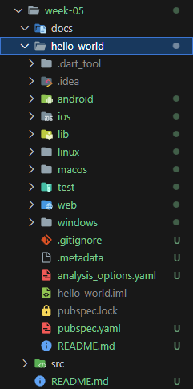
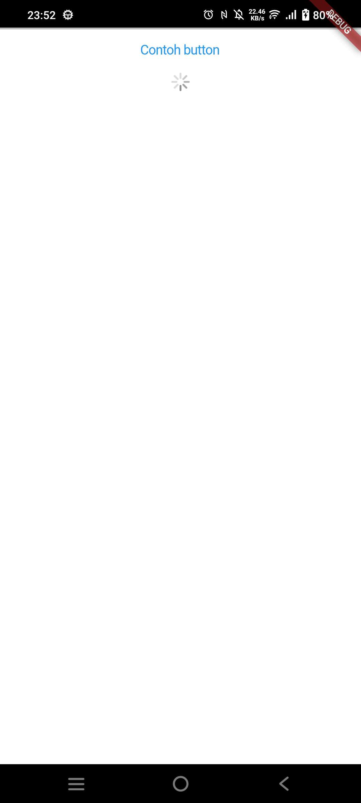

# Pemrograman Mobile - Pertemuan 5

NIM :  2141720031

NAMA : Josafat Pratama Susilo

A new flutter project.

## Daftar Isi

- [Praktikum 1](#praktikum-1)
- [Praktikum 2](#praktikum-2)
- [Praktikum 3](#praktikum-3)
- [Praktikum 4](#praktikum-4)
- [Tugas Praktikum](#tugas-praktikum)

## Praktikum 1



Praktikum 1 melakukan setup sebuah project flutter baru, saya tidak sempat mengambil screenshot untuk output dari terminal mengenai "Your Flutter Project is Ready" sehingga saya mengambil screenshot dari folder project yang telah dibuat.

## Praktikum 2


Pada Praktikum 2 melakukan run dan debugging pada project flutter yang telah dibuat, hasilnya seperti output diatas.

## Praktikum 3

Praktikum 3 melakukan penerapan Widget dasar, berupa Text dan Image. Berikut merupakan detailnya.

Pada bagian pertama, menambahkan sebuah widget MyTextWidget dengan isi nama saya beserta output sebagai berikut:


Terdapat kendala ketika saya menjalankan aplikasi flutter pada device fisik saya, yaitu tidak dapat berjalannya fitur hot reload dan stuck pada 

```Observatory Listening on *********************```

seperti gambar di bawah. Hal ini dikarenakan VIVO menyembunyikan beberapa log informasi private dengan wrap ****. Cara mengatasinya adalah dengan menghubungi official authorization VIVO berdasarkan sumber berikut:
https://siwing.github.io/Flutter/Vivo%20phone%20system%20log%20output%20problem.html.


Kemudian pada bagian selanjutnya, menambahkan sebuah widget MyImageWidget untuk menampilkan logo polinema, namun terdapat kendala bahwa tidak dapat ditampilkan di device android fisik saya, sehingga saya harus menjalankan di chrome menggunakan command ```flutter run -d chrome``` dengan output sebagai berikut:


## Praktikum 4

Kemudian pada praktikum 4 menerapkan berbagai macam widget dari Material Design dan iOS Cupertino. Berikut merupakan beberapa hasil output widget yang telah diterapkan.

Cupertino Button dan Loading Bar



Floating Action Button (FAB)


Date Picker dan Time Picker


## Tugas Praktikum

1. Screnshot hasil praktikum selesai, dengan hasil screenshot berada di docs.

2. Pembuatan file widget tersendiri selesai dan berada di folder lib, untuk hasil output sebagai berikut

   
3. Berikut merupakan repository GitHub penyelesaian Codelabs: Your first Flutter app: [Link Repository](https://github.com/yosaphatprs/first-flutter-app-codelab)

4. Capture hasil akhir praktikum berada pada file README.md ini