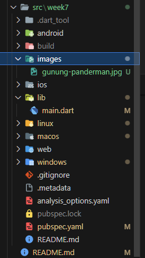
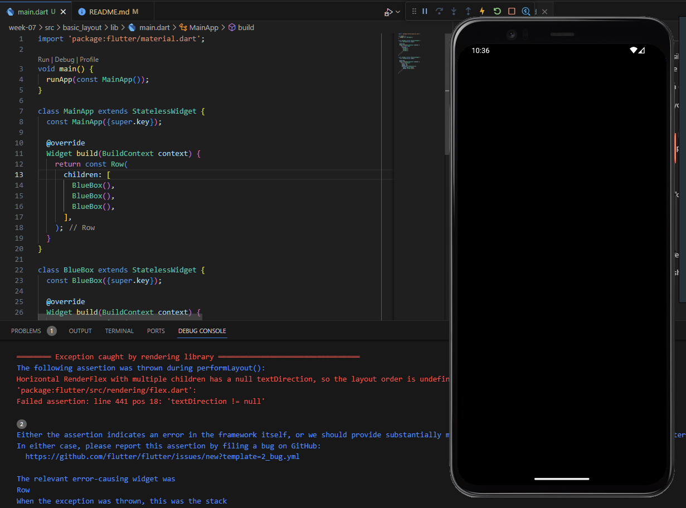
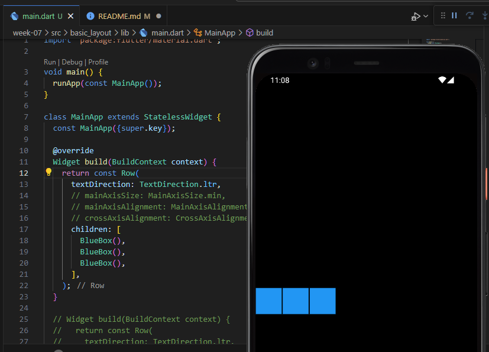

# Pemrograman Mobile - Pertemuan 7

NIM :  2141720031

NAMA : Josafat Pratama Susilo

Layout

Layout yang akan dibuat:


## Daftar Isi

- [Praktikum 1](#praktikum-1)
- [Praktikum 2](#praktikum-2)
- [Praktikum 3](#praktikum-3)
- [Praktikum 4](#praktikum-4)
- [Tugas Praktikum](#tugas-praktikum)

## Praktikum 1 Membangun Layout di Flutter

### Langkah 1

Buatlah sebuah project flutter baru dengan nama layout_flutter di dalam folder src. Buat dengan command pallete ```CTRL+SHIFT+P```.


### Langkah 2

Berikut merupakan output dan pengubahan file main.dart yang telah dilakukan:


### Langkah 3

Langkah selanjutnya adalah mengidentifikasi layout diagram dari tampilan yang akan dibuat. Hal tersebut dilakukan dengan mengenali secara garis besar layout dari sebuah tampilan, kemudian identifikasi secara lebih detail dari hasil identifikasi tadi. Setelah itu, langkah selanjutnya akan menerapkan pendekatan bottom-up untuk implementasi layout yang telah diidentifikasi.


### Langkah 4

Pada langkah ini, akan dilakukan implementasi layout yang telah diidentifikasi pada langkah sebelumnya. Diawali dengan membuat kolom bagian kiri pada judul. Berikut merupakan implementasinya:


## Praktikum 2 Implementasi Button Row

### Langkah 1

Untuk implementasi button, karena kode pembuatannya hampir sama, yang membedakan hanya icon dan text saja, maka lebih baik jika membuat sebuah fungsi yang akan return widget sesuai dengan yang diinginkan supaya lebih efisien. Berikut merupakan implementasinya:


### Langkah 2 & 3

Tambahkan widget buttonSection pada bagian body. Berikut merupakan implementasinya:


## Praktikum 3

### Langkah 1 & 2 - Buat widget textSection & Tambahkan variabel text section ke body

Pada Langkah ini, buat sebuah widget textSection dengan menambahkan padding di setiap tepinya sebesar 32 piksel. Nilai ```softWrap = true```, sehingga text akan wrap ke baris baru jika tidak muat. Berikut merupakan implementasi dan outputnya:


## Praktikum 4

### Langkah 1 - Siapkan aset gambar untuk implementasi image section

Pada langkah ini, siapkan aset gambar yang akan digunakan, kemudian simpan di folder images pada root folder week7.



Kemudian tambahkan ke dalam pubspec.yaml seperti berikut:


### Langkah 2 - Tambahkan gambar ke body

Tambahkan image ke dalam children seperti berikut:


BoxFit.cover digunakan untuk memastikan bahwa gambar akan selalu muat di dalam kotak yang telah ditentukan.

### Langkah 3 - Mengubah menjadi ListView

Pada langkah ini, ubahlah Column menjadi ListView agar dapat di-scroll pada layar yang lebih kecil, hal ini membuat aplikasi lebih responsive. Berikut merupakan hasilnya:


## Tugas Praktikum

1. Selesaikan Praktikum 1 sampai 4, lalu dokumentasikan dan push ke repository Anda berupa screenshot setiap hasil pekerjaan beserta penjelasannya di file README.md!

    - Praktikum 1 - 4 sudah selesai dilakukan dan di-push ke repository.

2. Silakan implementasikan di project baru "basic_layout_flutter" dengan mengakses sumber ini: https://docs.flutter.dev/codelabs/layout-basics

    - Implementasi sudah dilakukan, project baru berada dalam folder src dengan nama basic_layout dan di-push ke repository. Berikut merupakan laporan implementasinya
        
        ### Row and Column classes
        Ketika mengerjakan codelab bagian ini, terdapat error ketika menggunakan Row, error yang dimaksud adalah sebagai berikut

        

        Cara mengatasinya adalah menambahkan ```textDirection: TextDirection.ltr``` pada Row, sehingga dapat dilihat perbedaan output row dan column pada tabel berikut.

        Berikut perbedaan row (baris) dan column (kolom).
        | Row | Column |
        | --- | --- |
        |  |  |
        | Row menempatkan item secara horizontal | Column menempatkan item secara vertikal |

        ### Axis size and alignment

        #### mainAxisSize property

        mainAxisSize property digunakan untuk mengatur ukuran dari Row atau Column berdasarkan axis-nya. Berikut merupakan tabel perbandingan penerapan MainAxisSize.max dengan MainAxisSize.min pada class Row.

        | MainAxisSize.max | MainAxisSize.min |
        | --- | --- |
        |  |  |
        | MainAxisSize.max membuat Row mengambil seluruh lebar layar | MainAxisSize.min membuat Row mengambil lebar yang dibutuhkan |

        #### mainAxisAlignment property

        mainAxisAlignment property digunakan untuk mengatur posisi dari item-item yang ada di dalam Row atau Column. Berikut merupakan tabel perbandingan penerapan MainAxisAlignment.start, dan MainAxisAlignment.end pada class Row.

        | MainAxisAlignment.start | MainAxisAlignment.end |
        | --- | --- |
        |  |  |
        | MainAxisAlignment.start membuat item-item berada di sebelah kiri (start/awal) | MainAxisAlignment.end membuat item-item berada di sebelah kanan (end/akhiran) |

        #### crossAxisAlignment property

        crossAxisAlignment property digunakan untuk mengatur posisi dari item-item yang ada di dalam Row atau Column berdasarkan Cross Axis-nya (kebalikannya). Berikut merupakan tabel perbandingan penerapan CrossAxisAlignment.center, dan CrossAxisAlignment.start pada class Row.

        | CrossAxisAlignment.center | CrossAxisAlignment.start |
        | --- | --- |
        |  |  |
        | CrossAxisAlignment.center membuat item-item berada di tengah | CrossAxisAlignment.start membuat item-item berada di sebelah start dari Column yaitu atas (start/awal) |

        ### Flexible widget

        Flexible widget digunakan untuk mengatur bagaimana item-item di dalam Row atau Column akan mengambil ruang yang tersedia. Berikut merupakan tabel perbandingan penerapan FlexFit.tight dan FlexFit.loose pada class Row.

        | FlexFit.loose | FlexFit.tight |
        | --- | --- |
        |  |  |
        | FlexFit.loose membuat item-item mengambil ruang yang dibutuhkan | FlexFit.tight membuat item-item mengambil ruang yang tersedia |

        ### Expanded widget

        Expanded widget digunakan untuk mengatur bagaimana item-item di dalam Row atau Column akan mengambil ruang yang tersedia. Berikut merupakan tabel perbandingan penerapan Expanded pada class Row.

        | Non-Expanded | Expanded |
        | --- | --- |
        |  |  |
        | Non-Expanded membuat item-item mengambil ruang yang dibutuhkan | Expanded membuat item-item mengambil ruang yang tersedia |

        ### SizedBox widget

        SizedBox widget digunakan untuk mengatur ukuran dari item-item di dalam Row atau Column berdasarkan ukuran yang telah ditentukan melalui width dan/atau height. Berikut merupakan tabel perbandingan penerapan SizedBox tanpa dan dengan height pada class Row.

        | SizedBox tanpa height | SizedBox dengan height |
        | --- | --- |
        |  |  |
        
        SizedBox juga dapat digunakan untuk memberi jarak atau space antar item. Berikut merupakan contohnya:

        | SizedBox 50 pixel space antara item 1 dan 2 | SizedBox 25 pixel space antara item 2 dan 3 |
        | --- | --- |
        |  |  |

        ### Spacer widget

        Spacer widget juga dapat digunakan untuk membuat space seperti SizedBox,  namun ukuran dalam Spacer Widget diimplementasikan dengan flex, bukan menggunakan nilai piksel seperti SizedBox. Berikut merupakan tabel perbandingan penerapan 1 Spacer dan 2 Spacer pada class Row.

        | 1 Spacer | 2 Spacer |
        | --- | --- |
        |  |  |

        ### Text widget

        Text widget digunakan untuk menampilkan teks. Berikut merupakan tabel perbandingan penerapan CrossAxisAlignment.center dengan CrossAxisAlignment.baseline pada class Row dalam penggunaan Text Widget.

        | CrossAxisAlignment.center | CrossAxisAlignment.baseline |
        | --- | --- |
        |  |  |

        ### Icon widget

        Icon widget digunakan untuk menampilkan icon. Berikut merupakan tabel perbandingan sebelum menambahkan Icon baru dengan warna Amber dan sebelum menambahkan Icon baru dengan warna Amber pada class Row.

        | Sebelum menambahkan Icon baru | Setelah menambahkan Icon baru |
        | --- | --- |
        |  |  |

        ### Image widget

        Image widget digunakan untuk menampilkan gambar. Berikut merupakan tabel perbandingan penerapan Image widget untuk pic1, pic2, dan pic3 menggunakan Image.network pada class Row.

        | pic1 | pic2 | pic3 |
        | --- | --- | --- |
        |  |  |  |

        ### Membuat Business Card

        #### Part 1 - Membuat Nama dan Judul

        

        #### Part 2

        

        #### Part 3

        

3. Kumpulkan link commit repository GitHub Anda ke spreadsheet yang telah disediakan!

    - Link commit sudah dikumpulkan ke spreadsheet yang telah disediakan.