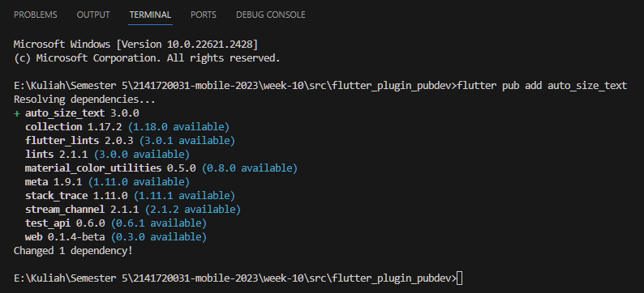
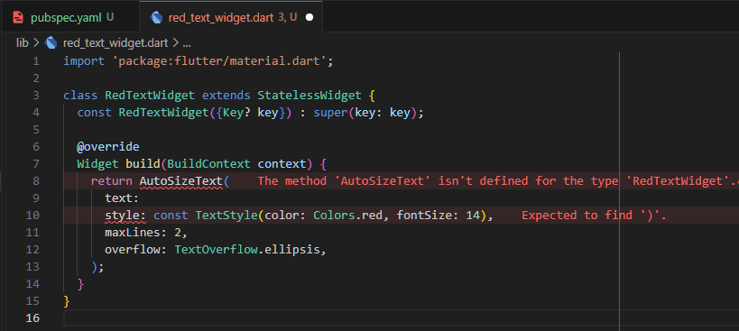
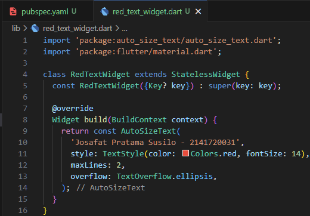
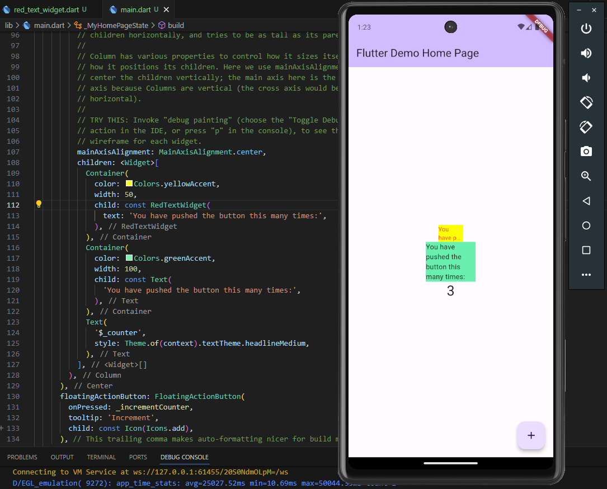

# Pemrograman Mobile - Pertemuan 10 Manajemen Plugin

NIM :  2141720031

NAMA : Josafat Pratama Susilo

## Daftar Isi

- [Praktikum 1](#praktikum-1)
- [Tugas Praktikum](#tugas-praktikum)

## Praktikum 1 Menerapkan Plugin di Project Flutter

- Menambahkan plugin auto_size_text melalui terminal.

  

- Pada Langkah 4 Praktikum 1 terdapat error seperti berikut:

  

  Error diatas disebabkan karena compiler tidak mengenali AutoSizeText, sehingga perlu untuk ditambahkan import pada file tersebut. Kemudian terdapat error pada baris 10 yang menyatakan perlu adanya tanda kurung tutup, hal ini dikarenakan text seharusnya diisi oleh string langsung bukan parameter yang memiliki value dan dipisahkan oleh tanda koma. 

  Perbaikan dari error di atas kurang lebih adalah sebagai berikut:

  

- Berikut merupakan hasil dari output praktikum 1.
  
  

## Tugas Praktikum

1. Selesaikan Praktikum tersebut, lalu dokumentasikan dan push ke repository Anda berupa screenshot hasil pekerjaan beserta penjelasannya di file README.md!

2. Jelaskan maksud dari langkah 2 pada praktikum tersebut!

   - Maksud dari langkah 2 adalah menambahkan plugin dengan cara menuliskan pada terminal, hal itu akan mengedit pubspec.yaml dan menambahkan plugin yang diinginkan.

3. Jelaskan maksud dari langkah 5 pada praktikum tersebut!

   - Maksud dari langkah 5 adalah membuat variabel text yang akan ditampilkan serta mengisikannya dalam fungsi constructor class tersebut.

4. Pada langkah 6 terdapat dua widget yang ditambahkan, jelaskan fungsi dan perbedaannya!

   - Fungsi dari 2 widget itu adalah menampilkan text, namun widget yang digunakan berbeda. Widget yang pertama digunakan adalah auto_size_text yang memiliki fungsi untuk menyesuaikan ukuran text dengan ukuran widget yang ada. Sedangkan widget yang kedua digunakan adalah text yang memiliki fungsi untuk menampilkan text dengan ukuran yang tetap.

5. Jelaskan maksud dari tiap parameter yang ada di dalam plugin auto_size_text berdasarkan tautan pada dokumentasi [ini](https://pub.dev/documentation/auto_size_text/latest/) !

   - Parameter-parameter yang ada dalam plugin auto_size_text adalah sebagai berikut:

        | Parameter | Keterangan |
        | --- | --- |
        | `key*` | Mengontrol bagaimana satu widget menggantikan widget lain dalam widget tree.|
        | `textKey` | Mengatur key untuk widget Teks yang dihasilkan. |
        | `style*` | Style yang digunakan pada text (jika tidak null) |
        | `minFontSize` | Batas ukuran teks minimum yang digunakan. Jika presetFontSizes diatur, parameter ini akan diabaikan |
        | `maxFontSize` | Batas ukuran teks maksimum yang digunakan. Jika presetFontSizes diatur, parameter ini akan diabaikan. |
        | `stepGranularity` | Ukuran step di mana ukuran font disesuaikan dengan batasan yang ada. |
        | `presetFontSizes` | Menentukan font size yang akan digunakan. Penting: presetFontSizes harus dalam urutan menurun. |
        | `group` | Menyinkronkan ukuran beberapa AutoSizeText. |
        | `textAlign*` | Penempatan text pada widget pada sumbu horizontal |
        | `textDirection*` | Arah dari karakter yang dapat menentukan tampilan teks berdasar textalign |
        | `locale*` | Digunakan untuk memilih font ketika karakter Unicode yang sama dapat dirender secara berbeda berdasarkan karakter lokalnya. |
        | `softWrap*` | Menentukan apakah teks harus ada pemisahan baris. |
        | `wrapWords` | Menentukan apakah kata-kata yang tidak muat dalam satu baris harus di-_wrap_. Defaultnya adalah true. |
        | `overflow*` | Cara penanganan tampilan yang overflow atau melebih batas parent widget. |
        | `overflowReplacement` | Jika teks melebihi batas dari parent widget dan, widget ini ditampilkan sebagai pengganti. |
        | `textScaleFactor*` | Jumlah piksel font untuk setiap piksel. Juga memengaruhi minFontSize, maxFontSize, dan presetFontSizes. |
        | `maxLines` | Batas maksimum jumlah baris untuk teks. |
        | `semanticsLabel*` | Label semantik alternatif untuk teks yang ada. |

6. Kumpulkan laporan praktikum Anda berupa link repository GitHub ke spreadsheet yang telah disediakan!