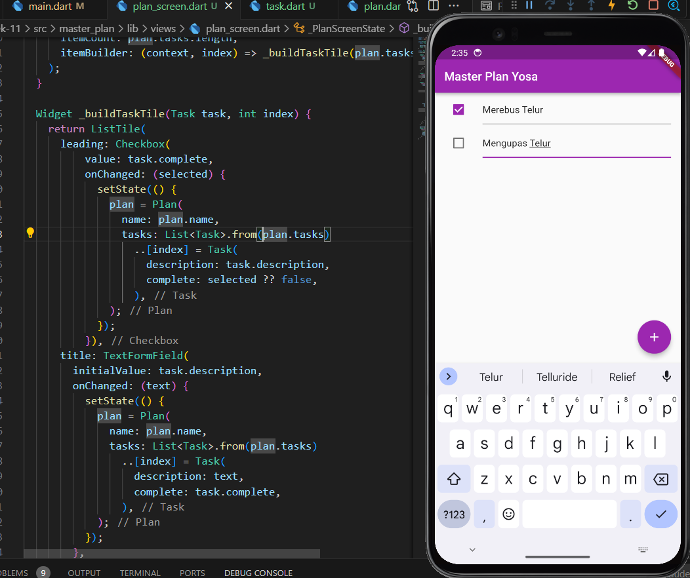
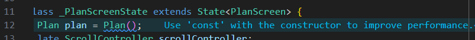
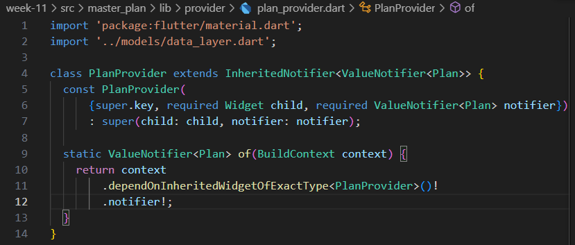
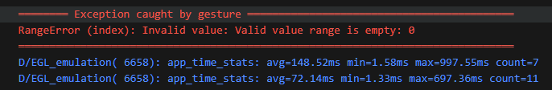
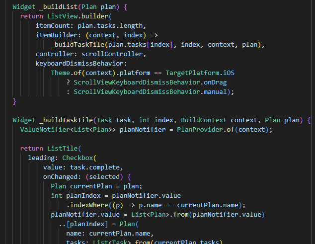
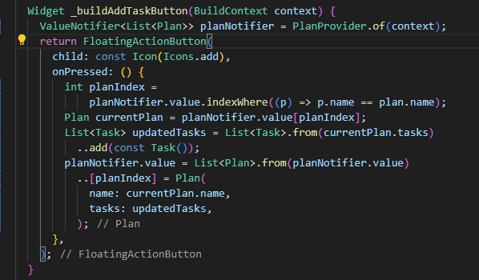

# Pemrograman Mobile - Pertemuan 11 Dasar State Management

NIM :  2141720031

NAMA : Josafat Pratama Susilo

## Daftar Isi

- [Praktikum 1](#praktikum-1-dasar-state-dengan-model-view)
- [Tugas Praktikum 1](#tugas-praktikum-1)
- [Praktikum 2](#praktikum-2-mengelola-data-layer-dengan-inheritedwidget-dan-inheritednotifier)
- [Tugas Praktikum 2](#tugas-praktikum-2)
- [Praktikum 3](#praktikum-3-membuat-state-di-multiple-screens)
- [Tugas Praktikum 3](#tugas-praktikum-3)

## Praktikum 1 Dasar State dengan Model-View

Program yang akan dibuat pada praktikum ini adalah sebuah program yang berfungsi untuk mencatat plan dengan fitur ceklis pada setiap plan yang dibuat. Program ini akan dibuat dengan menggunakan model-view state management. Berikut adalah checkpoint-checkpoint pada program tersebut.

1. Output Langkah 9

    Screenshot:

    

    GIF:

    

    Hingga langkah 9, program telah berhasil dibuat dan dapat menambahkan plan baru serta mengubah status ceklis pada plan tersebut. Namun saat terdapat plan yang cukup banyak dan mengakibatkan layar perlu untuk di-_scroll_ maka ketika kita ingin mencari plan yang diisi akan terhalangi oleh keyboard yang tetap muncul. Hal ini akan diperbaiki pada langkah selanjutnya.

2. Output Hasil

   

   Dengan beberapa perubahan seperti menambahkan scrollController yang akan menghapus focus pada masing-masing text field ketika melakukan scroll akan membuat keyboard tidak menghalangi textfield. Sehingga hasil akhir dari program master_plan yang dibuat pada Praktikum 1 akan tampil seperti di atas


## Tugas Praktikum 1

1. Selesaikan langkah-langkah praktikum tersebut, lalu dokumentasikan berupa GIF hasil akhir praktikum beserta penjelasannya di file README.md!

    - 

2. Jelaskan maksud dari langkah 4 pada praktikum tersebut! Mengapa dilakukan demikian?

    - Penambahan data_layer.dart yang dilakukan pada langkah 4 bertujuan untuk membuat class yang berisi data/model yang akan digunakan pada program. Hal tersebut sangat bermanfaat dalam menulis kode yang efisien dan efektif, karena jika terdapat banyak data/model yang perlu untuk diimpor pada suatu file, hal ini dapat disingkat dengan hanya melakukan import pada data_layer.dart. Dapat dibayangkan jika terdapat 10 data class dan ingin melakukan import 10 data class tersebut pada beberapa file, maka hal tersebut tentu akan tidak efektif dan ribet. Maka dari itu diperlukanlah data_layer.dart ini.

3. Mengapa perlu variabel plan di langkah 6 pada praktikum tersebut? Mengapa dibuat konstanta ?

    - Hal ini dikarenakan isi atau beberapa widget dari file plan_screen.dart memerlukan model data dari Plan itu sendiri, sehingga perlu untuk dibuat variabel objek dari class Plan. Variabel ini dibuat konstanta karena dapat membuat performa aplikasi lebih baik, hal ini dibuktikan ketika saya menghapus keyword `const` pada variabel plan akan muncul seperti berikut.

        

        Penjelasan lebih lanjut dari hal ini ini adalah, pembuatan sebuah variabel konstanta berarti variabel tersebut merepresentasikan waktu compile yang konstan dan di dalam memori yang sama karena value dari variabel itu secara implisit dapat dikatan final dan tidak dapat berubah. Pada file plan_screen.dart, konstanta plan berfungsi untuk memanggil constructor dari plan itu sendiri dan ketika beberapa kali memanggil plan itu sendiri memori yang akan dialokasikan akan lebih efisien karena instance dari plan itu hanya ada satu atau sama saja di dalam memori.

4. Lakukan capture hasil dari Langkah 9 berupa GIF, kemudian jelaskan apa yang telah Anda buat!

    - GIF:

        

        Aplikasi yang telah dibuat adalah aplikasi untuk menyimpan Plan dengan fitur penambahan plan dan ceklis yang dibuat dengan menggunakan struktur model-view.

5. Apa kegunaan method pada Langkah 11 dan 13 dalam lifecyle state ?

    - `initState`: method initState pada lifecycle state berguna untuk melakukan inisialisasi data yang dibutuhkan oleh widget. Method ini akan dipanggil ketika widget pertama kali dibuat. Pada program ini, method ini digunakan untuk menginisialisasi scrollController yang akan menghapus focus pada masing-masing text field ketika melakukan scroll.
    - `dispose`: methode dispose pada lifecycle state berguna untuk melakukan pembersihan data yang tidak diperlukan lagi. Method ini akan dipanggil ketika widget dihapus dari tree. Pada program ini, method ini digunakan untuk membersihkan data yang tidak diperlukan lagi pada listview yang berisi plan yang telah dibuat.

6. Kumpulkan laporan praktikum Anda berupa link commit atau repository GitHub ke spreadsheet yang telah disediakan!

## Praktikum 2 Mengelola Data Layer dengan InheritedWidget dan InheritedNotifier

Pada praktikum 2, ditambahkan adanya penerapan InheritedWidget dan InheritedNotifier dengan adanya pembuatan sebuah file yang memiliki peran sebagai provider yaitu file plan_provider.dart. 

Isi dari file plan_provider.dart itu adalah sebagai berikut:



Pada praktikum kali ini tidak terdapat perubahan UI, namun hanya melakukan perubahan pada sistem state management yang lebih tepat untuk digunakan. Praktikum ini bertujuan untuk menerapkan cara memisahkan antara view dengan model secara tepat. Karena hal ini sangat penting dalam state management sebuah aplikasi.

Output:


## Tugas Praktikum 2

1. Selesaikan langkah-langkah praktikum tersebut, lalu dokumentasikan berupa GIF hasil akhir praktikum beserta penjelasannya di file README.md!

    - Hasil akhir:

        

2. Jelaskan mana yang dimaksud InheritedWidget pada langkah 1 tersebut! Mengapa yang digunakan InheritedNotifier?

    - Yang dimaksud InheritedWidget pada langkah 1 dalam file plan_provider ada pada baris ke 11 pada screenshot berikut

       
        
       ```dart 
       .dependOnInheritedWidgetOfExactType<PlanProvider>()!
       ```

       Arti dari baris diatas adalah, untuk mendapatkan instance PlanProvider yang ada dalam context widget tersebut. Kemudian terdapat tanda seru di akhir baris tersebut yang berarti hasil dari method tersebut tidak boleh null. Hal ini dilakukan karena jika hasil dari method tersebut null, maka akan program akan error.

    - Sebenarnya InheritedWidget juga digunakan dalam file plan_provider.dart, seperti yang telah ditunjukkan pada point sebelumnya. Hanya saja InheritedWIdget tidak memiliki fungsi yang dapat melakukan notify widget dibawahnya secara _built-in_ sehingga diperlukan juga InheritedNotifier untuk melakukan hal tersebut.

3. Jelaskan maksud dari method di langkah 3 pada praktikum tersebut! Mengapa dilakukan demikian?

    - Method-method yang digunakan pada langkah 3 berfungsi untuk menghitung jumlah task yang selesai dan return hasilnya. Kemudian completenessMessage berfungsi untuk menunjukkan pesan mengenai jumlah task yang telah selesai.

4. Lakukan capture hasil dari Langkah 9 berupa GIF, kemudian jelaskan apa yang telah Anda buat!

    - 
    
        Praktikum 2 ini menambahkan sebuah text dibawah yang menunjukkan jumlah task yang telah diselesaikan atau diceklis dari aplikasi Praktikum 1. Kemudian terdapat tambahan pada kode program untuk menerapkan state management yang baik dengan menggunakan InheritedWidget dan InheritedNotifier. 
    

5. Kumpulkan laporan praktikum Anda berupa link commit atau repository GitHub ke spreadsheet yang telah disediakan!

## Praktikum 3 Membuat State di Multiple Screens

Pada Praktikum 3 ini diterapkan state management dengan multiple screen. Hasil dari praktikum 3 ini adalah sebagai berikut.


Pada hasil akhir tersebut, terdapat ketidaksesuaian dengan yang seharusnya yaitu tidak berfungsinya checkbox dan tidak dapat untuk menambahkan task baru. Hal ini akan dibenahi pada tugas praktikum 3.

## Tugas Praktikum 3

1. Selesaikan langkah-langkah praktikum tersebut, lalu dokumentasikan berupa GIF hasil akhir praktikum beserta penjelasannya di file README.md! Jika Anda menemukan ada yang error atau tidak berjalan dengan baik, silakan diperbaiki sesuai dengan tujuan aplikasi tersebut dibuat.

    - Dengan program yang berjalan kurang baik, maka perlu diperbaiki. Berdasarkan hasil dari debug console, ditemukan error sebagai berikut:
        

        Sehingga ditemukan bahwa terdapat masalah pada index yang digunakan, yaitu valuenya yang empty atau kosong. Berikut adalah perbaikan yang dilakukan.

        - Mensinkronkan plan yang ada pada fungsi _buildTaskTile dengan yang ada pada _buildList yaitu dengan melakukan passing parameter plan tersebut. Perubahan:

            

        - Mengubah plan yang ada pada _buildAddTaskButton sesuai dengan index plan planNotifier tersebut. Perubahan:

            
        
2. Berdasarkan Praktikum 3 yang telah Anda lakukan, jelaskan maksud dari gambar diagram berikut ini!

    

    Diagram di atas menjelaskan mengenai bagaimana korelasi antar 2 screen yang ada dalam aplikasi yang telah dibuat. Screen pertama berupa PlanCreatorScreen yang merupakan turunan dari PlanProvider dalam struktur widget tree. Di dalam PlanCreatorScreen terdapat sebuah Column yang menampung widget-widget di dalamnya. Korelasi yang ada adalah, PlanScreen dituju melalui PlanCreatorScreen menggunaakn Navigator Push. Sehingga PlanProvider tetap dapat diakses oleh PlanScreen.

3. Lakukan capture hasil dari Langkah 14 berupa GIF, kemudian jelaskan apa yang telah Anda buat!

    Berikut merupakan hasil akhir dari program yang telah dibuat.
    

    Beberapa yang telah dibuat pada Praktikum 3 adalah mengubah plan menjadi list plan pada plan provider karena akan dibuat plan-plan yang akan menampung beberapa task. Kemudian membuat sebuah screen plan_creator_screen yang digunakan untuk menambahkan plan-plan. Ketika plan ditekan akan menuju pada halaman task-task dari plan tersebut yaitu screen plan_screen.