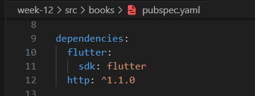
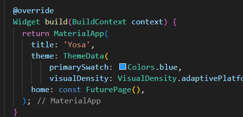
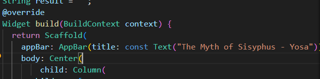
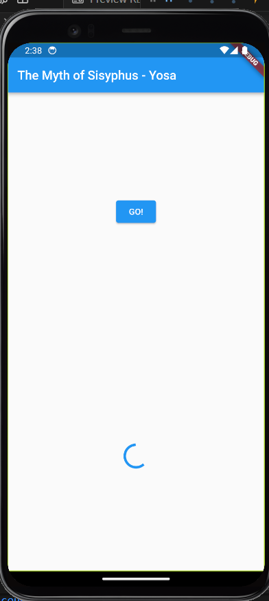
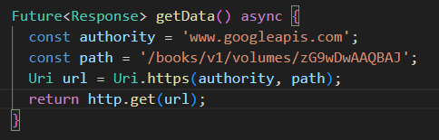
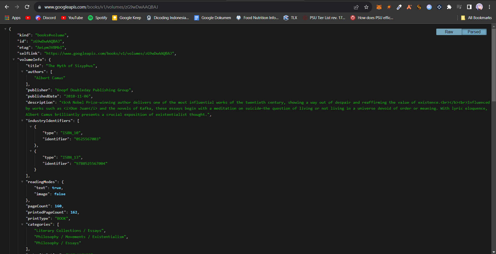
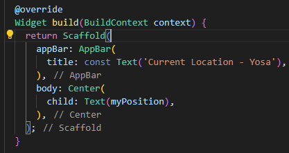

# Pemrograman Mobile - Pertemuan 12 Pemrograman Asynchronous

NIM :  2141720031

NAMA : Josafat Pratama Susilo

## Daftar Isi

- [Praktikum 1 : Mengunduh Data dari Web Service (API)](#praktikum-1-mengunduh-data-dari-web-service-api)

- [Praktikum 2 : Menggunakan await/async untuk menghindari callbacks](#praktikum-2-menggunakan-awaitasync-untuk-menghindari-callbacks)

- [Praktikum 3 : Menggunakan Completer di Future](#praktikum-3-menggunakan-completer-di-future)

- [Praktikum 4 : Memanggil Future secara paralel](#praktikum-4-memanggil-future-secara-paralel)

- [Praktikum 5 : Menangani Respon Error pada Async Code](#praktikum-5-menangani-respon-error-pada-async-code)

- [Praktikum 6 : Menggunakan Future dengan StatefulWidget](#praktikum-6-menggunakan-future-dengan-statefulwidget)

## Praktikum 1 Mengunduh Data dari Web Service (API)

1. Menambahkan package `http` pada `pubspec.yaml`

    

2. Menambahkan nama panggilan pada `title` app. (**Soal 1**)

    

    

    

3. Tambah method getData()

    
    
4. Tampilan JSON google books buku favorit: The Myth of Sisyphus (**Soal 2**)

    

5. (**Soal 3**) Jelaskan maksud `substring` dan `catchError` pada kode langkah 5 dan tampilkan hasil berupa GIF.

    `substring` : Mengambil sebagian dari string. Terdapat dua argument di dalamnya, yang pertama adalah index elemen awal dari string yang ingin di ambil, kemudian index elemen akhir dari string yang ingin di ambil. pada langkah 5 dimulai dari index awal yaitu 0 dan index terakhir yaitu 450.

    `catchError` : Digunakan untuk melakukan handle error yang mungkin terjadi ketika mengeksekusi baris kode dengan Future. catchError menangkap error yang terjadi dan melakukan sesuatu terhadap error tersebut. Pada langkah 5 digunakan untuk menangkap error yang terjadi pada saat mengambil data melalui http.

    

## Praktikum 2 Menggunakan await/async untuk menghindari callbacks 

**Soal 4**

1. Jelaskan maksud kode langkah 1 dan 2 tersebut!

    - Langkah 1: Maksud dari kode langkah 1 adalah membuat 3 fungsi asynchronous yang masing-masing memiliki delay 3 detik untuk melakukan return value-nya. Setiap fungsi memiliki nilai return berbeda sesuai dengan nama fungsi tersebut.

    - Langkah 2: Maksud dari kode langkah ke 2 adalah untuk menjalankan ketiga fungsi yang telah dibuat dan return yang ada akan dijumlahkan dalam variabel total. Setiap pemanggilan fungsi terdapat delay 3 detik sehingga total untuk mendapatkan total dari 3 fungsi tersebut dibutuhkan waktu 9 detik.

2. Capture hasil praktikum Anda berupa GIF dan lampirkan di README. Lalu lakukan commit dengan pesan "W12: Soal 4".

    

## Praktikum 3: Menggunakan Completer di Future

**Soal 5**

1. Jelaskan maksud kode langkah 2 tersebut!

    - Maksud dari kode diatas adalah untuk membuat sebuah fungsi calculate() yang mengembalikan nilai Future. Nilai itu dikembalikan dengan memanggil fungsi method complete pada completer. Nilai yang dikembalikan sesuai dengan tipe data Completer yaitu int bernilai 42.

2. Capture hasil praktikum Anda berupa GIF dan lampirkan di README. Lalu lakukan commit dengan pesan "W12: Soal 5".

    

**Soal 6**

1. Jelaskan maksud perbedaan kode langkah 2 dengan langkah 5-6 tersebut!

    - Perbedaannya pada langkah 5-6 menggunakan try and catch sehingga jika terdapat error akan lebih mudah melakukan handle error tersebut.

2. Capture hasil praktikum Anda berupa GIF dan lampirkan di README. Lalu lakukan commit dengan pesan "W12: Soal 6".

    

## Praktikum 4: Memanggil Future secara paralel

**Soal 7**

1. Capture hasil praktikum Anda berupa GIF dan lampirkan di README. Lalu lakukan commit dengan pesan "W12: Soal 7".

    

**Soal 8**

1. Jelaskan maksud perbedaan kode langkah 1 dan 4!

    - Perbedaan dari kode langkah 1 dan 4 adalah pada langkah 1 menggunakan futureGroup untuk menjalankan future secara paralel sedangkan pada langkah 4 menggunakan method Future.wait

## Praktikum 5: Menangani Respon Error pada Async Code

**Soal 9**

1. Capture hasil praktikum Anda berupa GIF dan lampirkan di README. Lalu lakukan commit dengan pesan "W12: Soal 9".

    

**Soal 10**

1. Panggil method handleError() tersebut di ElevatedButton, lalu run. Apa hasilnya? Jelaskan perbedaan kode langkah 1 dan 4!

    - Berdasarkan hasil dari output yang didapat, tidak ada perbedaan pada jalannya program. Perbedaan yang ada hanya dari penggunaan try and catch pada langkah 4, sedangkan pada langkah 1 menggunakan .then.catchError().

## Praktikum 6: Menggunakan Future dengan StatefulWidget

**Soal 11**

1. Tambahkan nama panggilan Anda pada tiap properti title sebagai identitas pekerjaan Anda.

    

**Soal 12**

1. Jika Anda tidak melihat animasi loading tampil, kemungkinan itu berjalan sangat cepat. Tambahkan delay pada method getPosition() dengan kode await Future.delayed(const Duration(seconds: 3));

2. Apakah Anda mendapatkan koordinat GPS ketika run di browser? Mengapa demikian?

3. Capture hasil praktikum Anda berupa GIF dan lampirkan di README. Lalu lakukan commit dengan pesan "W12: Soal 12".

    