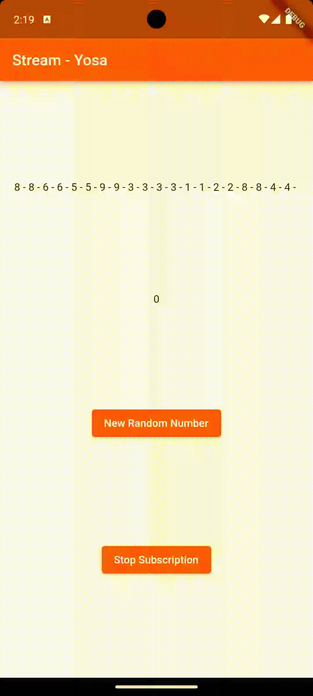

# Pemrograman Mobile - Pertemuan 13 Lanjutan State Management dengan Streams

NIM :  2141720031

NAMA : Josafat Pratama Susilo

## Daftar Isi

- [Praktikum 1: Dart Streams](#praktikum-1-dart-streams)

- [Praktikum 2: Stream controllers dan sinks](#praktikum-2-stream-controllers-dan-sinks)

- [Praktikum 3: Injeksi data ke streams](#praktikum-3-injeksi-data-ke-streams)

- [Praktikum 4: Subscribe ke stream events](#praktikum-4-subscribe-ke-stream-events)

- [Praktikum 5: Multiple stream subscriptions](#praktikum-5-multiple-stream-subscriptions)

- [Praktikum 6: StreamBuilder](#praktikum-6-streambuilder)

- [Praktikum 7: BLoC Pattern](#praktikum-7-bloc-pattern)

## Praktikum 1: Dart Streams

**Soal 1**

1. Tambahkan nama panggilan Anda pada title app sebagai identitas hasil pekerjaan Anda.

2. Gantilah warna tema aplikasi sesuai kesukaan Anda.

    

3. Lakukan commit hasil jawaban Soal 1 dengan pesan "W13: Jawaban Soal 1"

**Soal 2**

1. Tambahkan 5 warna lainnya sesuai keinginan Anda pada variabel colors tersebut.

    

    Warna yang ditambahkan adalah sebagai berikut:

    ```dart
    Colors.deepOrange,
    Colors.lightGreen,
    Colors.indigo,
    Colors.lime,
    Colors.redAccent,
    ```
2. Lakukan commit hasil jawaban Soal 2 dengan pesan "W13: Jawaban Soal 2"

**Soal 3**

1. Jelaskan fungsi keyword yield* pada kode tersebut!

    Keyword yield* digunakan untuk melakukan return dari sebuah fungsi generator. Pada kode tersebut fungsi generator yang dimaksud adalah Stream.periodic yang akan mengembalikan colors setiap 1 detik. Dengan adanya yield ini maka ketika fungsi Stream.periodic melakukan return colors, fungsi Stream.periodic akan tetap berjalan walau telah melakukan return karena yield yang akan mengembalikan nilai dari fungsi tersebut. Tanda bintang setelah keyword yield menandakan bahwa nilai yang dikembalikan bukan hanya satu melainkan sebuah stream.

2. Apa maksud isi perintah kode tersebut?

    Maksud dari perintah kode tersebut adalah untuk mendapatkan nilai berupa Color setiap 1 detik. 

3. Lakukan commit hasil jawaban Soal 3 dengan pesan "W13: Jawaban Soal 3"

**Soal 4**

1. Capture hasil praktikum Anda berupa GIF dan lampirkan di README.

    

2. Lakukan commit hasil jawaban Soal 4 dengan pesan "W13: Jawaban Soal 4"

**Soal 5**

1. Jelaskan perbedaan menggunakan listen dan await for (langkah 9) !

    Perbedaan dari listen dan await for adalah bagaimana cara kerja kedua method tersebut. Await for akan menjalankan stream tersebut hingga stream tersebut selesai, sehingga cocok untuk digunakan pada stream yang memiliki jumlah data terbatas/finite. Sedangkan listen akan meregister stream tersebut terlebih dahulu baru akan menjalankan stream tersebut, sehingga cocok untuk digunakan pada stream yang memiliki jumlah data yang tidak pasti.

2. Lakukan commit hasil jawaban Soal 5 dengan pesan "W13: Jawaban Soal 5"

## Praktikum 2: Stream controllers dan sinks

**Soal 6**

1. Jelaskan maksud kode langkah 8 dan 10 tersebut!

    Kode langkah 8 berguna untuk menginisiasi state yang akan digunakan, inisiasi tersebut membuat numberStream yang merupakan objek dari class NumberStream. Dengan numberStream tersebut, dibuat sebuah stream yang dapat digunakan pada class _StreamHomePageState.

    Kode langkah 10 berfungsi untuk generate angka acak kemudian mengirimkan angka tersebut ke dalam stream yang ada menggunakan fungsi addNumberToSink.

2. Capture hasil praktikum Anda berupa GIF dan lampirkan di README.

    

3. Lalu lakukan commit dengan pesan "W13: Jawaban Soal 6".

**Soal 7**

1. Jelaskan maksud kode langkah 13 sampai 15 tersebut!

    Pada langkah 13, membuat sebuah fungsi untuk menambahkan error ke sink. Kemudian pada langkah 14 mengimplementasikannya pada onError, jika error akan mengatus angka ke negatif 1. Kemudian pada langkah 15, menambahkan error ke fungsi addRandomNumber()

2. Kembalikan kode seperti semula pada Langkah 15, comment addError() agar Anda dapat melanjutkan ke praktikum 3 berikutnya.

3. Lalu lakukan commit dengan pesan "W13: Jawaban Soal 7".
s
## Praktikum 3: Injeksi data ke streams

**Soal 8**

1. Jelaskan maksud kode langkah 1-3 tersebut!

    - Maksud dari penggunaan StreamTransformer adalah, untuk memanipulasi data yang ada pada stream. Pada langkah kedua, StreamTransformer diinisialisasi dalam initstate. Kemudian, stream yang ada, akan melalui transformer yang telah dibuat dan listen ke pada event-event yang berlangsung.

2. Capture hasil praktikum Anda berupa GIF dan lampirkan di README.

    

3. Lalu lakukan commit dengan pesan "W13: Jawaban Soal 8".

## Praktikum 4: Subscribe ke stream events

**Soal 9**

1. Jelaskan maksud kode langkah 2, 6 dan 8 tersebut!

    Penerapan subscription merupakan _best practice_ menghandle event dan eror yang ada dalam stream. Langkah 2 merupakan proses ```listen``` kepada stream yang ada. Kemudian langkah 6 adalah proses menutup subscription dalam stream tersebut dalam fungsi dispose. Langkah 8 melakukan edit pada fungsi ketika menambahkan random number, edit tersebut memiliki arti bahwa ketika stream telah ditutup melalui fungsi stopStream(), maka angka akan menjadi -1.
 
2. Capture hasil praktikum Anda berupa GIF dan lampirkan di README.

    

    

3. Lalu lakukan commit dengan pesan "W13: Jawaban Soal 9".

## Praktikum 5: Multiple stream subscriptions

**Soal 10**

1. Jelaskan mengapa error itu bisa terjadi ?

    Error itu dapat terjadi karena ada 2 subscription yang berjalan secara bersamaan untuk melakukan listen terhadap stream tersebut.

**Soal 11**

1. Jelaskan mengapa hal itu bisa terjadi ?

    Hal tersebut dapat terjadi karena terdapat terdapat 2 stream yang melakukan listen terhadap stream yang sama melalui broadcast. Hal tersebut menyebabkan setiap kali ada event klik pada button, maka 2 subscription akan menghandle event tersebut. Setelah itu, variable values akan ditampilkan sesuai pada langkah 5.

2. Capture hasil praktikum Anda berupa GIF dan lampirkan di README.

    

3. Lalu lakukan commit dengan pesan "W13: Jawaban Soal 10,11".

## Praktikum 6: StreamBuilder

**Soal 12**

1. Jelaskan maksud kode pada langkah 3 dan 7!

    Langkah 3 berfungsi untuk membuat stream yang akan generate angka random setiap 1 detik, sedangkan langkah 7 berfungsi untuk implementasi stream menggunakan StreamBuilder. Ketika terdapat error maka akan melakukan log, jika snapsot memiliki data, maka akan menampilkan data tersebut.

2. Capture hasil praktikum Anda berupa GIF dan lampirkan di README.

    

3. Lalu lakukan commit dengan pesan "W13: Jawaban Soal 12".

## Praktikum 7: BLoC Pattern

1. Jelaskan maksud praktikum ini ! Dimanakah letak konsep pola BLoC-nya ?

    Pada praktikum ini, konsep BLoC diterapkan dalam file random_bloc.dart untuk menghasilkan stream yang melakukan generate angka random. Pada file random_screen, variabel _bloc digunakan untuk menginisialisasi objek dari random_bloc, dan StreamBuilder digunakan untuk menangani stream yang dihasilkan oleh random_bloc tersebut. Terdapat juga tombol refresh yang berfungsi untuk menghasilkan angka acak baru dengan memanggil fungsi sink pada _generateRandomController yang terdapat dalam random_bloc.dart.

2. Capture hasil praktikum Anda berupa GIF dan lampirkan di README.

    

3. Lalu lakukan commit dengan pesan "W13: Jawaban Soal 13".